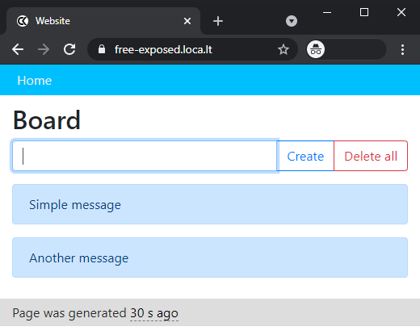

# Free Exposed Website

Docker image of free exposed website which can be hosted on
any device supported by **Python 3** and **Node.js** or **Docker**.
Website will be automatically available to the internet at https://free-exposed.loca.lt/ if it's
currently not occupied.

The website would also be available to hosting machine by http://localhost:5000/ (note the **http** protocol here).

## Requirements

- Docker

**OR**

- Python 3
- Node.js

## Usage

### Docker

#### Building Docker image
```bash
docker build -t free-exposed-website .
```

#### Running Docker container
```bash
docker container run --rm -p 5000:5000 -it free-exposed-website
```

### Python3 and Node.js

#### Installing required packages
```bash
pip3 install -r requirements.txt
npm install -g localtunnel
```

#### Running 
```bash
lt --port 5000 --subdomain=free-exposed &
python3 -m flask run --host=0.0.0.0 --port=5000
```

## Screenshots
Result of
```bash
docker image build -t free-exposed-website . && docker container run -it -p 5000:5000 --rm free-exposed-website
```


Website design:
